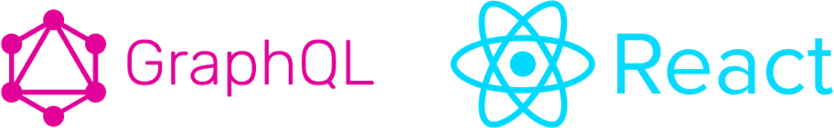

import { Appear, Head, Image } from 'mdx-deck';
import { Invert, Split } from 'mdx-deck/layouts';
import { Layout } from './src'

export { default as theme } from './src/theme';

<Head>
  <title>Big fails theory</title>
</Head>


---
export default Layout


👩🏻‍💻 Product & Frontend **@Joinedapp**

☕️ Coffee Addict

⚛️ **@ReactJSMadrid** Organizer

🌏 Travel Lover


```notes
- This is me
- Love learning
```

---
export default Layout

## MY NAME IS MARTA
# I am going to talk about my 📖

---
<Image src='images/joking.gif' />
---

<Image src='images/longtimeago.png' />

```notes
- Paginas web (HTML, CSS y algo de JQuery, incluso PHP)
- Ingeniería informatica y ADE
- Falta de practica y nuevas tecnologías
```
---
export default Layout


## Was I ready to have a job?

- Good practices
- Clean code
- Ruby + Ruby on rails
- Javascript

```notes
- Ironhack
- Proyecto desde cero
- Mejorar la calidad de mi codigo y aprender a trabajar en proyectos reales
- Conocí a grandes profesionales y me metí en la comunidad
```

---
export default Layout


## My first startup
- Lots of different technologies
- Junior developer + no experience + huge project
- Legacy code

```notes
- Python
- Javascript, Coffeescript, Handlebars... una autentica ruleta
- Pero producto dejó de tener importancia y empezamos a hacer proyectos nuevos para terceros
- Viaje a Dublin GDG -> Polymer
```

---
export default Layout

And **JS** (really) came to me


```notes
- Nuevo proyecto
- Una oportunidad para aprender full stack JS
- Pero...Llegó el final, aunque no todo se acabó
```

---
export default Invert

## Life is unexpected

MAD ✈️ SFO

```notes
- Alvaro me pone en contacto con Milena
- Estuvimos semanas pensando com enfocar el proyecto (funcionalidades, producto, negocio...)
- MVP para Pear.vc -> Node + Express vs Ruby on Rails
- Me voy
```

---
export default Layout


## I co-founded a startup 😱

* CTO, Designer, developer... **WHATEVER**
*
* Rails + Web components

```notes
- Startup way of life, crazy summer
- I worked and learnt like never before
- Fail fast fail better
- Improving code and reusing web components with rails -> REACTJS
```

---
export default Layout


⚛️ Reusing components

🏃🏻‍♀️ Fail fast fail better ? Be faster

```notes
- One summer to do the entire project
- Reusing components
- I need to be faster
```

---

export default Invert

### Once again...

## Life is unexpected

SFO ✈️ MAD

```notes
- Volvi a España para encontrar un trabajo y seguir aprendiendo de alguien senior
- Acabé como CPO de otra startup
```

---
export default Layout


-

## Challenges... a lot of challenges

♻️ Redo the platform

👩🏻‍💻 Hire a new team

🤯 Make more decisions

```notes
- Reto
- Como decidimos el stack
- PREGUNTA DINAMICA: Graphql en prod? Imaginad hace 2 años...
```
---

export default Invert


### What's happening right now?
* ReactJS
* NextJS
* AI
* Express + NodeJS
* Gatsby


```notes
- Express EJS -> Next.js + ReactJS + Styled components
- Transform an not clean structure in something LEGIBLE
```
---
export default Layout

# ✅ DOs
Think about the
* Business (Product)
* Project (Tech)
* Team (Hiring)

```notes
- BUSINESS: Necesito sacar el proyecto rapido? MINDLY explicar ejemplo

- PROJECT: Escalará bien usando esta tecnología? Y la arcquitectura o el esquema de la base de datos? Que variables priman? Hay que tener todo esto en cuenta BILLIN explicar proceso GRAPHQL
- PREGUNTA DINAMICA: Graphql en prod? Imaginad hace 2 años...

- TEAM: Vas a necesitar contratar a gente en tu proyecto, ten cuidado con elegir tecnologías que no son demandadas.
```

---
export default Layout

# ❌ DON'Ts
Think about the
* Business (Product)
* Project (Tech)
* Team (Hiring)


```notes
- BUSINESS: El negocio no puede pervertir el producto. Market fit tambien tiene que ser probado y la elección de tecnología no se puede ver influenciado por esto
- PROJECT: Do not overengineer Es mejor iterar poco a poco MICROSERVICIOS EL PRIMER DÍA?
- TEAM: No te puedes dejar llevar por modas. Panorama actual. ELIXIR, RAILS, etc.
```

---
export default Invert

## But the MOST important lesson

---
export default Layout

# TEAM
👩🏻‍💻

```notes
- Un proyecto itera gracias a la colaboración con el equipo
- Los problemas o errores de decisiones cometidos pueden subsanarse de forma automatica con un workflow sano
- Nada de code-blaming, cuando tengas una queja o creas que algo esta mal hecho busca una alternativa para solucionarlo
- He encontrado todo tipo de compañeros en estos años, y no todos los miembros de un equipo van a querer ser activos en la comunidad o tener side projects (VIAJAR, FOTOS, etc.).
```

---
export default Invert

# Thanks!
JSDayCAN2018 🇮🇨
