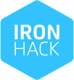
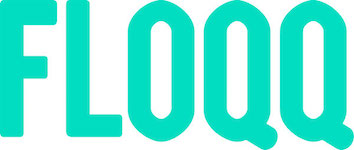
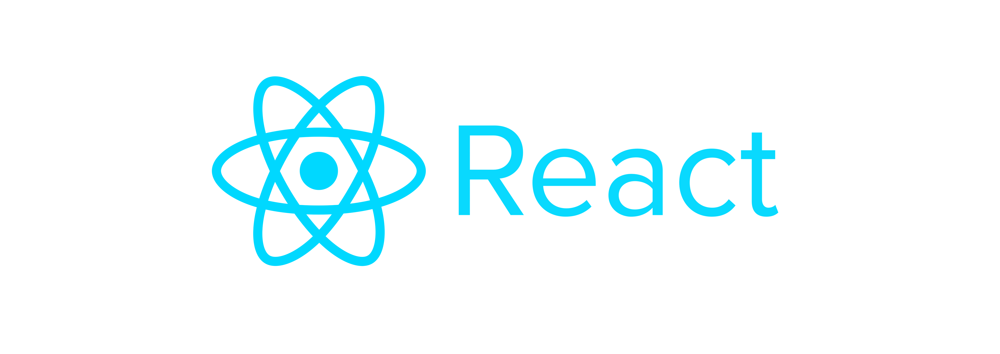
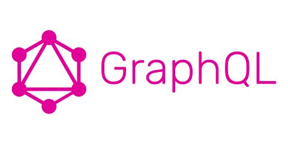

import { Appear, Head } from 'mdx-deck';
import { Invert, Split } from 'mdx-deck/layouts';

export { default as theme } from './theme';

<Head>
  <title>Big fails theory</title>
</Head>


---


👩🏻‍💻 Product & Frontend **@Joinedapp**

☕️ Coffee Addict

⚛️ **@ReactJSMadrid** Organizer

🌏 Travel Lover


```notes
- Este es mi presente
```

---

## MY NAME IS MARTA
# I am going to talk about my 📖

---
import { Image } from 'mdx-deck'

<Image src='images/joking.gif' />

---
export default Invert

# A long time ago...

```notes
- Ingeniería informatica y ADE
- Falta de practica y nuevas tecnologías
```
---



## Was I ready to have a job?

- Good practices
- Clean code
- Ruby + Ruby on rails
- Javascript

```notes
- Ironhack
- Proyecto desde cero
- Mejorar la calidad de mi codigo y aprender a trabajar en proyectos reales
```

---



## My first startup
- Lots of different technologies
- Junior developer + no experience + huge project
- Legacy code

```notes
- Python
- Javascript, Coffeescript, Handlebars... una autentica ruleta
- Proyectos nuevos
```

---

And **JS** came to me


```notes
- Nuevo proyecto
- Una oportunidad para aprender full stack JS
- Llegó el final
```

---

## Life is unexpected

MAD ✈️ SFO

```notes
- Alvaro me pone en contacto con Milena
- MVP para Pear.vc -> Node + Express vs Ruby on Rails
- Me voy
```

---

export default Split


## I co-founded a startup 😱
- I worked and learnt like never before
- CTO, CPO, Designer, junior developer, senior developer...
- Rails + Web components (~2015)

```notes
- Startup way of life
- Fail fast fail better
- Improving code and reusing web components with rails -> REACTJS
```

---



⚛️ Reusing components

🏃🏻‍♀️ Fail fast fail better ? Be faster

```notes
- Reusing components
- I need to be faster
```

---

export default Invert

### Once again...

## Life is unexpected

SFO ✈️ MAD

```notes
- Volvi a España para encontrar un trabajo y seguir aprendiendo de alguien senior
- Acabé como CPO de otra startup
```

---
export default Split




## Challenges... a lot of challenges

♻️ Redo the platform

👩🏻‍💻 Hire a new team

🤯 Make more decisions

```notes
- Reto
- Como decidimos el stack
- PREGUNTA DINAMICA: Graphql en prod? Imaginad hace 2 años...
```
---

export default Invert

### What's happening right now?


```notes
- Express EJS -> Next.js + ReactJS + Styled components
```
---
# ✅ DOs
Think about the
* Business (product)
* Project (tech)
* Team (Hiring)

```notes
- BUSINESS: Necesito sacar el proyecto rapido?
- PROJECT: Escalará bien usando esta tecnología? Y la arcquitectura o el esquema de la base de datos? Que variables priman?
- TEAM: Vas a necesitar contratar a gente en tu proyecto, ten cuidado con elegir tecnologías que no son demandadas.
- PREGUNTA DINAMICA: Graphql en prod? Imaginad hace 2 años...
```

---
# ❌ DON'Ts
Think about the
* Business (product)
* Project (tech)
* Team (Hiring)


```notes
- BUSINESS: El negocio no puede pervertir el producto. Market fit tambien tiene que ser probado
- PROJECT: Do not overengineer Es mejor iterar poco a poco
- TEAM: No te puedes dejar llevar por modas
```

---
export default Invert

## But the MOST important lesson

---
# TEAM
👩🏻‍💻

```notes
- Un proyecto itera gracias a la colaboración con el equipo
- Los problemas o errores de decisiones cometidos pueden subsanarse de forma automatica con un workflow sano
- Nada de code-blaming, cuando tengas una queja o creas que algo esta mal hecho busca una alternativa para solucionarlo
- He encontrado todo tipo de compañeros en estos años.
```

---
export default Invert

# Thanks!
